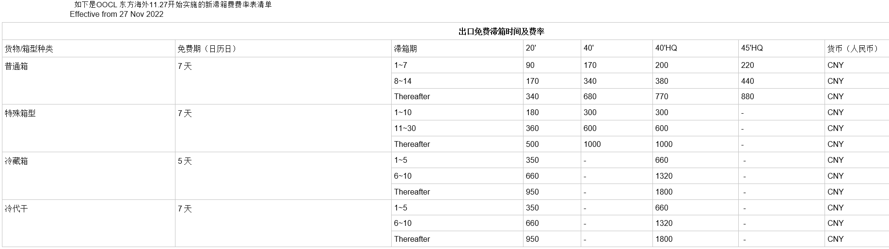
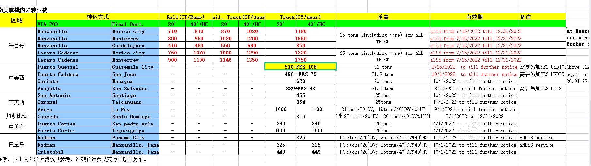
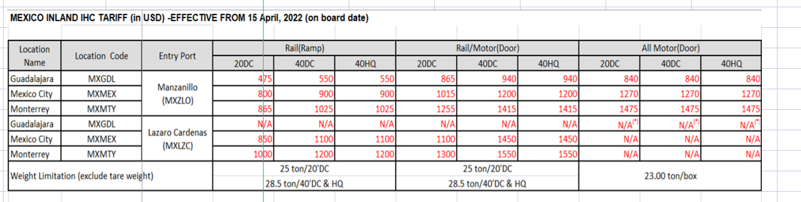

### 1.官网查询tianjin港口时，搜不到就输入xingang
- # 工作总结
  
  OOCL 东方海外11.27开始实施的新滞箱费费率表清单
   
  
  
  这是msk 框架的尺寸情况 大家看看 有不懂的及时问 特种柜永远都是利润点，我看最近两天大家也都积极联系机械客户了，不能只是短暂的热血沸腾，你们要坚持，时刻联系，时刻回访。
  
  
  MSC
  
- YML转运费
   
  
  
  
  OCL NOR南美西 21天  CMA14天
  
  ocl目的港超高收取费用是230
  
  1.立案承诺函所有的章都盖上我们的
  
  提单的分类：正本和电放
  
  中远海特出主单
  
  巴尔博亚一般选择msk线上
  
  CIQ
- # 港口航线划分
- # ocl高柜箱式费
# 危险品附加费

PIL 的危险品附加费 150 300

OOCL 3 6 8 9危险品统一附加费底价 200/300

阿里卡订hpl的，亚松森目前订阳明，中远，hpl未知

主单分单的区别我们是约主和船公司的约价

举例说明外贸公司（发货人）是甲，收货人是乙，收货代理是丁，货代公司（约主）是丙